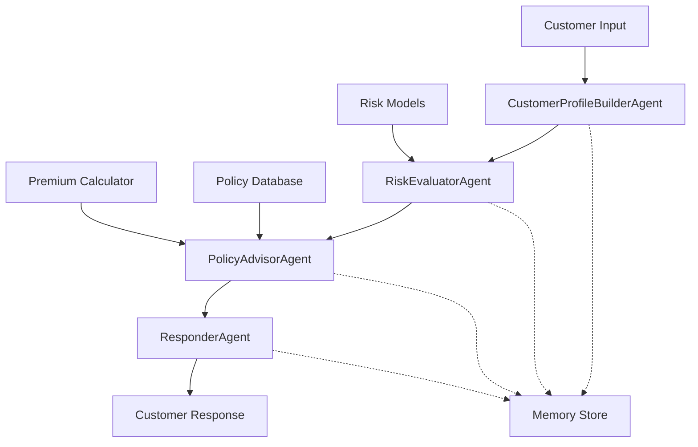

<<<<<<< HEAD
# AgenAIProject
=======
# 🏢 Semantic Kernel Insurance Bootcamp

> **Building Intelligent Insurance Solutions with AI Agents**

[](https://python.org)
[](https://github.com/microsoft/semantic-kernel)
[](https://azure.microsoft.com/en-us/products/ai-services/openai-service)
[](LICENSE)

## 🎯 Workshop Overview

This comprehensive one-day bootcamp teaches developers in the insurance domain how to build intelligent, multi-agent insurance recommendation systems using Microsoft's Semantic Kernel framework and Azure OpenAI.

### What You'll Build
By the end of this workshop, you'll have created a complete **Multi-Agent Policy Recommendation System** that can:
- 📊 Analyze customer profiles from natural language input
- ⚖️ Evaluate risk factors intelligently
- 🎯 Recommend personalized insurance policies
- 💬 Provide customer-friendly explanations and next steps
- 🤝 Orchestrate multiple AI agents working together

## 🚀 Quick Start

### Prerequisites
- Python 3.10+
- Azure subscription with OpenAI access
- VS Code or similar IDE
- Basic Python and async programming knowledge

### Setup
```bash
# Clone the repository
git clone [repository-url]
cd semantic-kernel-insurance-bootcamp

# Create virtual environment
python -m venv .venv
source .venv/bin/activate  # On Windows: .venv\Scripts\activate

# Upgrade pip
python -m pip install --upgrade pip

# Install dependencies
pip install semantic-kernel[azure] streamlit python-dotenv

# Configure environment
cp .env.example .env
# Edit .env with your Azure OpenAI credentials
```

### Test Your Setup
```python
# Run the setup verification
python -c "
import asyncio
from dotenv import load_dotenv
load_dotenv()
print('✅ Environment ready for workshop!')
"
```

📚 **Need help with setup?** → [Complete Setup Guide](docs/setup.md)

---

## 🗺️ Learning Path

Follow this structured learning path through the workshop modules:

### 📋 **Step 1: Preparation**
- 🔧 [Environment Setup](docs/setup.md) - Get your development environment ready
- 🏗️ [Insurance Domain Context](docs/insurance-context.md) - Understand insurance concepts and terminology

### 🎯 **Step 2: Fundamentals**
- 🔧 [Module 1: Semantic Kernel Fundamentals](modules/01-sk-fundamentals.md) - Learn SK basics, kernel creation, and function development

### 🛠️ **Step 3: Hands-On Labs**
- 🔹 [Lab 1: Policy Data Retriever Plugin](labs/lab1-policy-retriever.md) - Build your first insurance plugin
- 🤖 [Lab 2: PolicyAdvisorAgent](labs/lab2-policy-advisor.md) - Create an intelligent agent with memory
- 👥 [Lab 3: Multi-Agent System](labs/lab3-multi-agent.md) - Orchestrate multiple specialized agents
- 🚀 [Capstone Demo](labs/capstone-demo.md) - Deploy a complete end-to-end system

### 📚 **Step 4: Resources**
- 🔧 [Troubleshooting Guide](docs/troubleshooting.md) - Solutions to common issues
- 📖 [Advanced Topics](docs/advanced-topics.md) - Post-workshop learning paths

---

## 📅 Workshop Structure

| Time | Module | Activity | Resources |
|------|--------|----------|-----------|
| 9:00-9:30 | Welcome & Setup | Environment configuration | [Setup Guide](docs/setup.md) |
| 9:30-10:15 | SK Fundamentals | Kernel creation, AI services | [Module 1](modules/01-sk-fundamentals.md) |
| 10:15-11:00 | **Lab 1** | Build policy retrieval plugin | [Lab 1](labs/lab1-policy-retriever.md) |
| 11:15-12:00 | Agent Framework | Agent concepts and patterns | [Insurance Context](docs/insurance-context.md) |
| 13:00-14:00 | **Lab 2** | Single PolicyAdvisorAgent | [Lab 2](labs/lab2-policy-advisor.md) |
| 14:00-15:00 | Multi-Agent Design | Architecture patterns | Coming Soon |
| 15:00-15:45 | **Lab 3** | Multi-agent system | Coming Soon |
| 15:45-16:15 | **Capstone** | End-to-end demonstration | Coming Soon |

## 🚀 Why This Workshop?

### Traditional Insurance Challenges
- 📋 Manual policy research and comparison
- 📏 Static, one-size-fits-all risk assessments  
- 🔍 Limited customer context understanding
- ⏰ Slow, inefficient advisory processes

### AI-Enhanced Solution
- 🤖 Automated, intelligent policy matching
- 🧠 Dynamic risk evaluation with reasoning
- 👤 Personalized recommendations based on complete customer profiles
- ⚡ Real-time, conversational advisory experience

## ⚙️ Technical Stack

| Component | Technology | Purpose |
|-----------|------------|---------|
| **AI Framework** | Semantic Kernel (Python) | Agent orchestration and function calling |
| **AI Service** | Azure OpenAI (GPT-4) | Large language model for reasoning |
| **Development** | Python 3.10+, VS Code | Core development environment |
| **Package Management** | pip | Python package management |
| **UI Framework** | Streamlit | Interactive web interface |
| **Configuration** | python-dotenv | Environment management |

## 🏗️ Architecture Overview



## 📁 Repository Structure

```
semantic-kernel-insurance-bootcamp/
├── README.md                          # This file - Workshop overview and navigation
├── docs/                              # Documentation and guides
│   ├── setup.md                       # Environment setup instructions
│   ├── insurance-context.md           # Insurance domain knowledge
│   ├── troubleshooting.md             # Common issues and solutions
│   └── advanced-topics.md             # Post-workshop learning
├── modules/                           # Workshop modules
│   ├── 01-sk-fundamentals.md          # Semantic Kernel basics
│   ├── 02-plugin-development.md       # Plugin creation patterns
│   ├── 03-single-agent.md             # Agent architecture
│   ├── 04-multi-agent.md              # Multi-agent orchestration
│   └── 05-production-deployment.md    # Production considerations
├── labs/                              # Hands-on laboratory exercises
│   ├── lab1-policy-retriever.md       # Policy data retrieval plugin
│   ├── lab2-policy-advisor.md         # Single agent implementation
│   ├── lab3-multi-agent.md            # Multi-agent system
│   └── capstone-demo.md               # Final demonstration
├── src/                               # Source code (generated during labs)
│   ├── agents/                        # Agent implementations
│   ├── plugins/                       # Reusable plugins
│   ├── utils/                         # Utility functions
│   └── streamlit_app.py               # Web interface
├── data/                              # Sample data files
│   ├── sample_customers.json          # Test customer profiles
│   └── policy_database.json           # Mock policy data
├── .env.example                       # Environment variables template
└── .gitignore                         # Git ignore rules
```

## 🌟 Key Features Demonstrated

### 🤖 **Intelligent Agents**
- Natural language understanding for insurance queries
- Context-aware conversation management  
- Structured output generation
- Error handling and graceful degradation

### 👥 **Multi-Agent Orchestration**
- Sequential agent workflows
- Context passing between agents
- Memory management across agent boundaries
- Failure recovery and retry logic

### 🏢 **Insurance Domain Expertise**
- Policy type recommendations
- Risk factor evaluation
- Premium calculations
- Regulatory compliance considerations
- Customer communication best practices

### ⚡ **Production Readiness**
- Comprehensive error handling
- Performance monitoring
- Logging and debugging
- Scalable architecture patterns

## 🎓 Learning Outcomes

Upon completing this workshop, participants will be able to:

1. **Design AI Agent Systems**: Understand when and how to use single vs. multi-agent architectures
2. **Implement Semantic Functions**: Create domain-specific AI functions with proper prompt engineering
3. **Build Native Plugins**: Develop reusable components that integrate AI with business logic
4. **Orchestrate Agent Workflows**: Design and implement complex multi-agent interactions
5. **Handle Production Concerns**: Implement proper error handling, logging, and monitoring
6. **Apply to Insurance Domain**: Understand specific use cases and implementation patterns for insurance

## 🌍 Real-World Applications

The patterns learned in this workshop can be applied to:

- **Customer Service Chatbots**: Multi-agent systems for complex customer inquiries
- **Underwriting Automation**: AI-assisted risk evaluation and policy pricing
- **Claims Processing**: Intelligent claim evaluation and fraud detection
- **Regulatory Compliance**: Automated compliance checking and reporting
- **Sales Support**: Personalized policy recommendations and proposal generation

## 🔧 Development Setup Details

### Environment Variables
```bash
# Required for Azure OpenAI
AZURE_OPENAI_API_KEY=your_key_here
AZURE_OPENAI_ENDPOINT=https://your-resource.openai.azure.com/
AZURE_OPENAI_DEPLOYMENT_NAME=gpt-4
AZURE_OPENAI_API_VERSION=2024-02-01

# Optional for enhanced features
LOGGING_LEVEL=INFO
PERFORMANCE_MONITORING=true
```

### Dependencies Explained
- **semantic-kernel[azure]**: Core framework with Azure integrations
- **streamlit**: Web UI for demos and production interfaces
- **python-dotenv**: Environment variable management
- **asyncio**: Asynchronous programming support (built-in)
- **json**: Data serialization (built-in)

## 🤝 Contributing

We welcome contributions to improve this workshop:

1. Fork the repository
2. Create a feature branch (`git checkout -b feature/improvement`)
3. Make your changes and test them
4. Commit your changes (`git commit -m 'Add new feature'`)
5. Push to the branch (`git push origin feature/improvement`)
6. Create a Pull Request

### Areas for Contribution
- Additional insurance use cases
- Extended plugin functionalities
- UI/UX improvements
- Documentation enhancements
- Bug fixes and optimizations

## 📞 Support & Resources

### Getting Help
- **Workshop Issues**: Create an issue in this repository
- **Technical Questions**: Use GitHub Discussions
- **Setup Problems**: Check [Troubleshooting Guide](docs/troubleshooting.md)

### Documentation
- **Semantic Kernel Docs**: [Microsoft Learn](https://learn.microsoft.com/en-us/semantic-kernel/)
- **Azure OpenAI**: [Azure AI Services](https://azure.microsoft.com/en-us/products/ai-services/openai-service)
- **Python AsyncIO**: [Official Python Docs](https://docs.python.org/3/library/asyncio.html)

### Community
- [Semantic Kernel Discord](https://aka.ms/sk-discord)
- [Azure AI Community](https://techcommunity.microsoft.com/t5/ai-applied-ai-blog/bg-p/AIAppliedAIBlog)
- [Python Insurance Developers](https://github.com/topics/insurance-python)

## 📊 Workshop Success Metrics

By the end of the workshop, you should be able to:

- [ ] Create a working Semantic Kernel setup (100% success rate expected)
- [ ] Build functional insurance plugins (Lab 1 completion)
- [ ] Deploy a conversational agent (Lab 2 completion)  
- [ ] Orchestrate multi-agent systems (Lab 3 completion)
- [ ] Demonstrate end-to-end workflow (Capstone demo)
- [ ] Handle edge cases and errors gracefully
- [ ] Explain the architecture to stakeholders
- [ ] Identify next steps for production deployment

## 💬 What Participants Say

> *"This workshop transformed how I think about AI in insurance. The hands-on approach made complex concepts accessible."* - Senior Developer, Insurance Corp

> *"The multi-agent architecture patterns learned here are directly applicable to our claims processing system."* - Tech Lead, InsurTech Startup

> *"Excellent balance of theory and practice. Left with working code I could immediately apply."* - Solutions Architect, Digital Insurance

## 📝 License

This project is licensed under the MIT License - see the [LICENSE](LICENSE) file for details.

## 🙏 Acknowledgments

- Microsoft Semantic Kernel team for the excellent framework
- Azure OpenAI service for providing the AI capabilities
- Insurance industry experts who provided domain guidance
- Workshop participants who helped refine the content
- Open source community for inspiration and best practices

---

## 🚀 Ready to Start?

Choose your path:

### 🎯 **Quick Start** (Experienced Developers)
1. ⚡ [Setup Environment](docs/setup.md) → [SK Fundamentals](modules/01-sk-fundamentals.md) → [Lab 1](labs/lab1-policy-retriever.md)

### 📚 **Comprehensive Learning** (New to AI/Insurance)
1. 🏗️ [Insurance Context](docs/insurance-context.md) → [Setup](docs/setup.md) → [SK Fundamentals](modules/01-sk-fundamentals.md) → [Lab 1](labs/lab1-policy-retriever.md)

### 🔧 **Troubleshooting**
- Having issues? Start with [Troubleshooting Guide](docs/troubleshooting.md)

---

**Ready to revolutionize insurance technology with AI?** 🚀

*Built with ❤️ for the insurance developer community*
>>>>>>> 6f8a9df (initial commit)
